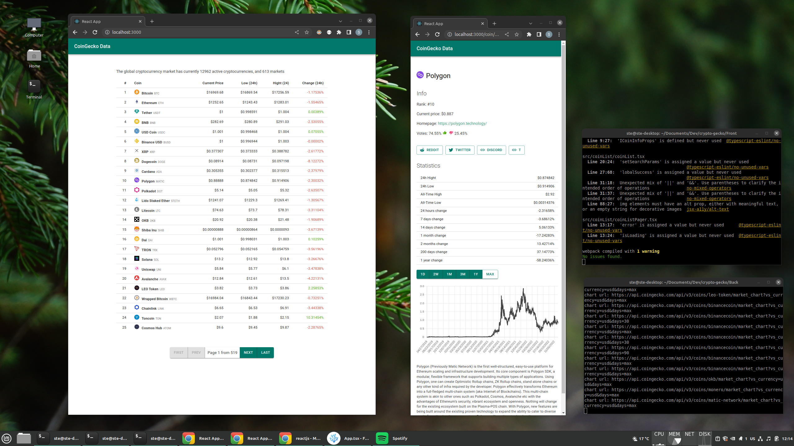

# CoinGecko frontend


## What's inside

- **Frontend:** Typescript using React, Redux-Toolkit, Material-UI, react-chartjs-2
- **Backend:** Javascript using Express




## Download

```bash
git clone https://git.vaidis.eu/stevaidis/crypto-coingecko.git
```

## Install

```bash
cd crypto-coingecko

# Back-end
cd Back
npm install

# Front-end
cd Front
npm install
```

## Run

```bash
# Back-end
cd Back
npm start

# Front-end
cd Front
npm start
```